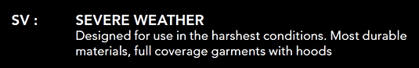
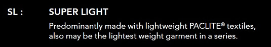
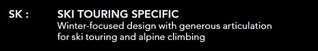

# Arc'Teryx 始祖鳥外套型號整理

##＠首先是 GoreTex 纖維的相關資訊：

```
GoreTex：最標準款，內層用PU，但不透氣。
GoreTex Pro：最耐磨，但也最厚重，通常用在酷寒環境，內層變成用防水膜比較透氣。
GoreTex Active：運動型的伸縮布料
GoreTex PacLite Shell：輕薄
```

## ＠依觸感與物理結構有分做：
```
Hard shell  硬殼
Soft shell   軟殼，沙沙聲的差別
```

##@再來是 Arc'Teryx 的型號英文資訊：

##衣長 
```
Alpha　　蓋屁股
Beta　　 只到屁股上方
Theta     比屁股還長
```

##功能性 
```
LT          Light weight 輕量化
SL          Super light   超輕量化
SV         Severe weather  酷寒氣候
FL          Fast & Light  運動用
AR         All round       泛用
```

外型，織工與外套型號的雜項
```
Hybrid：用不同布料達成耐磨又輕量的需求，
　　　　在容易磨損處用耐磨布料，其他部分用超輕量布料。
Atom Hoody：纖維短細蓬鬆，主要是保暖用，然後描述纖維外還包了矽來防水。
Gamma MX Hoody：比較像雨衣的外套，
Venta SV：防風透氣蓋屁股，有 Hybrid 的布料，比較像風衣。
Cerium：羽絨外套
Fission ：GoreTex Pro
Tecto Jecket：運動用外套(with GoreTex Active)，比較有伸縮性
Consort，Consular：防水防風輕便 with PacLite shell，風雨衣。
Celeris：無GoreTex的普通化纖風雨衣。
Convert Hoody：絨毛外套
Hyllus Hoody：使用 Polartec® Power Shield 技術，防水防風，保暖，而且外層軟，所以不會有沙沙聲。
SideWinder Shell：滑雪衣 with GoreTex Pro
Zeta Jecket：Zeta ???(不明．．．)
```


---


有玩裝備或是始祖鳥迷大概都知道Arc'teryx在

款式命名上，大部分會順便將其等級或用途的

縮寫加在款式型號上，以便選購時能在短時間

內分辨其功能或定位上的差異，然而一般常見

有 `AR, SV, LT, SL, MX, SK` 等等。

 

一般來說等級分類並不是絕對專業的差別（雖然它與價格有相對的關係  0rz），真正的重點在於使用上的方向。讓維京山屋帶大家看看原廠是怎麼分類這些等級， 




##SV（嚴苛極限氣候使用）：針對惡劣環境所設計，大部分使用最耐用的材質，為了應付嚴苛氣候都會加上風帽設計給予最完整的保護。 

適合三極探險，使用最耐用的材質讓使用者能以最安心的心情上路，但是相對所帶來的是重量，因此除非你要去那些地方或收藏，若只是在台灣使用大可不用買到此等級。


##AR（全方位 / 多功能使用）：使用中等厚度材質，能應付未來大多數的使用，以最完全的包覆剪裁設計。

使用耐用的材質，雖然稍重了一些，但所帶來的代價是非常耐用的愉悅，可以讓你還沒用壞，卻別人已換了好幾件的狀況，而且能百分百應付台灣所有的地形與氣候，例如：Beta AR Jacket 與 Gamma AR Jacket 都是耐操的出名。此代號若出現在底層排汗衣或中層保暖衣，則是(相對地)定位較適合秋冬使用，例如：Rho AR Zip Top 與 Delta AR Zip Top 系列。


##MX（混合環境使用）：針對混合天氣與多變地形環境使用，會儘可能地使用耐磨、透氣、排汗、高活動性的布料。

此定位的設計常只出現在 Soft Shell 類的衣物，台灣的四季分明與海拔變化度大，對於喜好一件衣服穿到底的使用者，通常滿適合這類的衣物。


##LT（輕量化）：使用輕量化材質，設計上朝俐落簡單，減少不必要的部份。

輕量化設計就不用解釋太多，以風雨衣來說大部分是降低表布的耐磨性來達到輕量；以保暖衣或排汗衣來說會使用較薄的布料，來達到適合三季的使用。



##SL（超輕量化）：使用最輕量的布料，在風雨衣上很明顯最具優勢就屬於 Gore-tex 的 Paclite 了，其他款式也會使用最輕量化的材質。

超輕量化設計來說，目前來說風雨衣一定使用 Paclite了，底層衣會以利用布料的四向彈性來降低太多的剪裁，例如：Rho SL Crew。另外會降低一些細節上的設計，或用不同的思惟來設計，就像 Alpha SL Pullover 是一個明顯的例子。



##SK（滑雪專用）：結合滑雪與雪地攀登的冬季設計。

滑雪專用，嗯......沒玩過，台灣也不太需要。冏。 

 

咦......也許有人會說怎麼漏了 LS 與 SS 這兩個？ 很簡單，這兩個只是長袖與短袖的代號而已，`LS（Long Sleeve）是長袖`，`SS（Short Sleeve）是短袖`，一點也不難。了解以上後是不是在選擇衣物上就輕鬆多了呢！

另外要理解的是並非每款產品都有六種等級設計，有些產品會視戶外需求做額外的設計開發，相對地有些產品並不需要某一類的設計。就像你會發現 Arc'teryx 的風雨衣沒有 MX 款式設計，或排汗衣沒有 SV、SK 款式設計的道理；還有 MX 設計似乎只出現在 Soft Shell 類衣物上，那是因為 MX 的概念本來就很接近 Soft Shell 的精神。符合需求才是選購的方向，不要以等級來陷入迷思，是維京山屋想要傳達的！
