# 機能材質說明

##GORE-TEX® PRO SHELL 

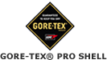


由特選最耐磨、最透氣、持久防水及防風的布料製造，專為應付持續惡劣天氣狀況而設計，最能滿足專業及熱愛戶外活動的人士所需。


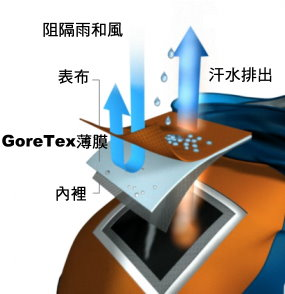
優點

最能滿足專業及熱愛戶外活動的人士所需。
專為應付持續惡劣天氣狀況而設計。
最耐磨、最透氣、持久防水及防風。
備有兩層及三層布料結構以供選擇。兩層布料質地柔軟，活動時不會發出噪音。
三層布料加強了耐磨的特性，無懼嚴峻天氣及環境。
由市面上最堅韌、耐磨的布料組合而成。
兩層結構：結合了GORE-TEX® 薄膜及高功能的表布，兩層黏合而製成，里布獨立分開。
兩層保暖結構：可於兩層布料及里布中間加上保暖內層。
三層結構：高效能的GORE-TEX® 薄膜與一種堅韌表布和特別設計的耐用里布黏合一起。
特有的GORE-SEAM® 防水膠帶技術保證所有接縫處皆 100% 防水。

GORE-TEX® PRO SHELL 的服裝
產品於生產前均先通過此項嚴格的風雨測試。模擬微雨、大雨至雷雨的情況，測試產品設計於不同天氣下的防水能力。利用先進技術設計服裝，確保衣服能有效抵禦極度及持續惡劣的天氣。


##performance shell

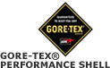

performance shell只需一件衣服，便可進行多項活動。

當您進行滑雪、騎單車、攀山、溜冰或散步等活動時，只要穿著 GORE-TEX® Performance Shell 的服裝，您大可隨意轉換其他活動，而不需要更換您原有的衣服。

優點


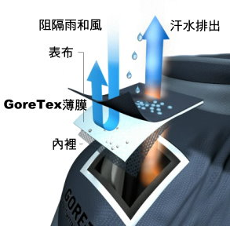

- 提供舒適的透氣功能和持久的防水保護。
- 最適宜進行各式各樣的戶外活動。
- 備有兩層及三層布料結構以供選擇。兩層布料質地柔軟，活動時不會發出噪音。三層布料加強了耐磨的特性。
- 結合柔軟及高功能的表布、薄膜及特製的里布。
- 兩層結構：結合了GORE-TEX® 薄膜及高功能的表布，兩層黏合而製成，里布獨立分開。
- 三層結構：GORE-TEX® 薄膜夾在表布及里布中間，三層黏合而製成。
- 可使用獨特的 GORE-TEX® 層隔里布，進一步增強布料的功能及舒適度。
- 特有的 GORE-SEAM® 防水膠條技術保證所有接縫處皆100%防水。

採用專利註冊的可調節保暖系統來控制舒適度。只需要利用內裡的氣閥，簡單快速地充氣或排氣，便能輕易地調整衣物內空氣層的厚薄情況，從而減少穿脫衣物的麻煩，輕鬆地迎接任何天氣變化。


##paclite


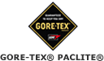

paclite適合遠足、騎單車、跑步及其他需要減輕背包重量及空間的活動。GORE-TEX® PACLITE® SHELL 極度透氣、持久防水及防風，輕巧及易於攜帶。

優點


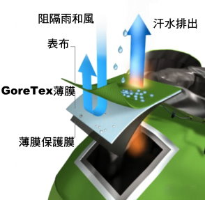

- 採用薄膜保護層，無須另加內裡。
- 持久防水，極度透氣。
- 輕巧及易於攜帶，兼具多用途。
- 表布由高功能人造纖維或尼龍製成。
- 採用防油污及含炭成份的薄膜保護層。
- 特有的 GORE-SEAM® 防水膠帶技術保證所有接縫處皆 100% 防水。

模擬微雨、大雨至雷雨的情況，測試產品設計於不同天氣下的防水能力。利用先進技術設計服裝，確保衣服能有效抵禦極度及持續惡劣的天氣。


## WINDSTOPPER也是Gore公司的一大產品。


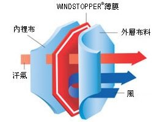


WINDSTOPPER薄膜重量極輕，卻不會減低所貼合布料之透氣性。

當冷風穿透衣服時，它會停留在衣服內，WINDSTOPPER產品具有絕佳的防風功能，可防止這種寒冷的感覺。 在風速10mph狀況下，測試相同重量絨毛布料，WINDSTOPPER絨毛織物，增加有效衣服舒適範圍達華氏十度以上。

優異的透氣性 
WINDSTOPPER被評定為『極透氣』織物產品，其優點是能使服裝，迅速散發過多的熱能與水份，因此可使您感到舒適不悶熱。


## powerdry Polartec Power Dry®


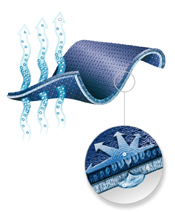


powerdry Polartec Power Dry®材質為100%
聚酯纖維，具有高透氣性，很適合設計成排汗內衣，適合各種運動。
Power Dry 是超強快乾布料擁有專利設計的bi-component結構設計，更有獨特的雙重構造；柔軟的內層接觸感非常舒適，而且可以快速吸收體表汗水，藉由排汗功能，將水氣散發出去，本布料特別適合台灣潮濕炎熱的氣候，它可以讓你輕鬆自在，隨時隨地保持乾爽、舒適。

獨特的雙重構造 bi-component knit 型成兩種不一樣的表面，內層使汗水快速帶離皮膚，另一層使汗水很快的蒸發。

皮膚上潮濕以及黏稠的汗水將使您非常的不舒服。

Power Dry能使您的皮膚乾爽藉由以下三種方法：

```
1.Power Dry材質輕又非常的透氣， 能使汗水的快速的蒸發。
2.接觸皮膚的內層能很快的將汗水帶至外層。雙層的結構比單層更能帶出多30%的汗水。
3.當汗水被帶到外層時，汗水將擴散到更大的表面，使得蒸發的速度兩倍快於綿質
```
Power Dry 能抗紫外線，UPF 15 BLOCKS 93% OF UV

- 專利bi-component結構設計使您留汗時依舊乾爽。
- 優異的透氣性讓你在任何的活動舒服、舒適。
- 快乾讓你的體溫流失減至最低。
- 抗紫外線(UPF 15) ，即使濕的情況下。
- 柔軟的表層讓你整天都舒適。


## Power Stretch


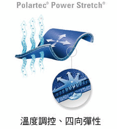


美商Malden Mills公司出品，Power Stretch®是針對激烈運動需求，而研發設計的機能性材質。在您運動時，它能提供身體全方向的包覆性，同時又具有四方延伸特點與傑出的透氣性。它獨特的篩孔3D結構，更能穩定的將暖空氣保留在氣孔中，更針對高濕度的狀況提供了調溫效果，而讓肌膚維持乾爽與舒適。Power Stertch

特點:

- 四向彈性提供身體活動時的舒適性，
- 即使您流汗依舊能保持您的肌膚乾爽、舒適。
- 激烈活動中不限制體內濕氣的蒸散作用。特別適合激烈運動，因為它提供了你所需的一切舒適、透氣、保暖。
- Power Stretch®內部表面的刷毛處理，提供了舒適與柔軟感受，不會有傳統保暖衣的壅腫不便。
- 抗風避免風寒效應。
- 原廠說明可以使用洗衣機洗。但是為了您的衣服，還是建議您用手洗，請勿使用冷洗精或衣物柔軟劑以免破壞材質結構。

## Polartec Classic


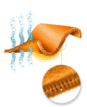

美國Malden Mills公司推出的材料。Polartec比一般的刷毛衣要輕、軟、暖和，而且不掉絨。 它不但乾的比較快，而且伸縮性也不錯。

Polartec Classic 100&200是一種輕、保暖又透氣的材質。它提供優良無比的品質及耐久性。近三十年來，戶外活動熱愛者總是以Polartec Classic 為保暖層的不二選擇。 迄今為止是戶外市場上最受歡迎的刷毛產品。

Polartec® Class 怎麼辦到的?

這100%聚酯纖維的絲絨許多空氣氣渦，因此可以抓住暖空氣並保持身體的溫暖。跟一般便宜的刷毛材質不同的是，Polartec比較輕且較保暖，濕了也較容易乾，並且在多次洗滌後仍然能維持本身的保暖度也不易起毛球。

對於不同險惡的氣候環境，Polartec 提供了100、200 、300不同厚度的保暖層。100系列的為輕量級，非常適合當做第一層或是輕量的保暖衣。200系列最常見，保暖性比100系列好，又沒有300系列那麼重，算多方面適用。300系列更暖和，不去很冷的地方用不著。

Polartec 生產線包含了超過90種樣式以及百種的顏色、花樣。很多款式亦提供了防潑水性以阻擋雨雪。

Polartec系列不但提供輕量且超優異的保暖性，並透氣、耐穿且乾的很快。

- 提供優異的保暖性且不會有傳統衣物的厚重
- 超級透氣讓您在各種活動都能感到舒適，並且不會阻擋汗水排出蒸發。
- 很多款式亦提供了防潑水性以阻擋雨雪。
- 濕了由內到外、由上到下乾，可以將溫度的流失減至最低。
- 耐穿，多次洗滌後仍然能維持本身的保暖度也不易起毛球。
- 提供輕量級100、中量級200、重量級300，提供不同層度的保暖度。用途多方面，適合各式的活動。


## Polartec Thermal Pro


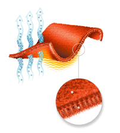

美國Malden Mills公司推出的材料。Polartec比一般的刷毛衣要輕、軟、暖和，而且不掉絨。 它不但乾的比較快，而且伸縮性也不錯。 Polartec Thermal Pro是Polartec進階的保暖材質，可應用在各種不同的布料上，最新的Polartec Thermal Pro纖維它提供優良無比的品質及耐久性。 這100%聚酯纖維的絲絨許多空氣氣渦，因此可以抓住暖空氣並保持身體的溫暖。跟一般便宜的刷毛材質不同的是，Polartec比較輕且較保暖，濕了也較容易乾，並且在多次洗滌後仍然能維持本身的保暖度也不易起毛球。

特點:

- 提供優異的保暖性且不會有傳統衣物的厚重
- 超級透氣讓您在各種活動都能感到舒適，並且不會阻擋汗水排出蒸發。
- 很多款式亦提供了防潑水性以阻擋雨雪。
- 濕了由內到外、由上到下乾，可以將溫度的流失減至最低。
- 耐穿，多次洗滌後仍然能維持本身的保暖度也不易起毛球。


## Polartec Windbloc


美國Malden Mills公司推出的防風材料。Polartec迄今為止是戶外市場上最受歡迎的刷毛布料。 
windbloc Windbloc 是一種薄膜，採用Windbloc做的衣服保暖性很好，而且百分之百防風。

此外，這材質柔軟、具研展性，以及抗潑水durable water repellent finish (DWR)還可以防一些水，霧雨、小雨僅會濕在表面。

Windbloc 材質在polartec 的刷毛材質上結合一防風的薄膜， 這層薄膜能使汗水由內往外蒸發，而且能100%防風。這樣的設計能使您不需要額外的防風衣，並能讓您減輕重量。

Windbloc材質非常的耐穿，穿著時不會有磨擦的噪音，不起毛球。

能提供相當好的保暖性。Windbloc 適合險惡嚴酷的天氣變化，適合當作戶外活動的保暖衣。

特點:

- 100%防風，可減低風寒效應。
- 提供絕佳的保暖性，可取代以往厚重的保暖衣。
- 表面防潑水處理，可防小雨及風雪。
- 表面不會有摩擦的噪音
- Polyurethane薄膜能透氣，讓您保持乾爽保暖及舒適。


## Power Shield

Power Shield®是由Malden Mill公司生產的系列Polartec®布料。Power Shield®具有耐磨、彈性、防風、潑水、保暖的功能，所以常拿來使用在Soft Shell。

Power Shield®的概念改良自舊有的三層式穿法，Power Shield®將保暖層與最外面的防水透氣層合而為一，Power Shield®有著極度耐磨的表面，長時間摩擦後仍保持外形和功能，並同時擁有外層耐磨、防風、潑水，及中層的保暖、彈性、透氣的功能。Power Shield®就是設計來取代傳統的刷毛衣( fleece )或是外套，戶外活動中不必再穿的像米其林，只要一件Power Shield®外套就能搞定。

Power Shield®表布是柔軟的、觸感柔軟、穿著不會有沙沙的摩擦聲；內層為短刷毛，可以抓住身體的暖空氣，維持舒適的溫度。

Power Shield® 獨特的Air Control Technology® (ACT)技術，能擋住98%外面的寒冷空氣，保留下2%讓內層的暖空氣循環，能讓Power Shield®比其他防風的材質以兩倍快的速度將濕氣、汗水快速的排出。

Power Shield®所有的布料都經過Durable Water Repellent (DWR)處理，具有極佳的潑水性，布料富有彈性，讓穿著時活動更加便利、舒適。洗滌保養亦方便、便利。


## PrimaLoft


PrimaLoft 原本是為了美國陸軍簽約而開發，為了取代當吸水時就失去保暖效果的羽絨。它獨特的結構取得了專利，生產線擴及戶外愛用者。自此，Primaloft One, Primaloft Sport及Primaloft Footwear 因為其柔軟、舒適及即使潮濕都能保持溫暖的特性，變成戶外專業者在各種天氣中各項保暖層的選擇，廣泛的運用在衣物、手套、睡帶等產品。

Primalof

它的設計概念來自於大自然中最保暖的"羽絨"。PrimaLoft模仿羽絨的結構，利用粗中空纖維為骨幹，並將細中空纖維合成纏繞在粗骨幹上面，形成如羽絨般的樹狀結構。讓PrimaLoftR在構造上得以和羽絨非常的近似。

由於它的中空纖維極細、極複雜，這樣的結構造成整塊PrimaLoft中有著數量極多、比水分子還小的氣室，這些氣室能抓住身體散發出的熱量，又有著高度的潑水性，即使整件衣服濕了，PrimaLoft仍具有高度的保暖效果，這是羽絨製品比不上的，也是人造纖維類的保暖材質比羽絨受歡迎的原因-便宜、易保養、濕了仍具有保暖效果。

PrimaLoft因為模仿羽絨的物理及保暖特性，而有著超輕、抗風、柔軟、濕了仍具保暖的功能。和其他的中空纖維(如Polarguard...)比起來，PrimaLoft One吸收水份的速度比它牌慢3倍；保暖效果多出它牌14%(乾燥時)及24%(濕透時)。


## Vibram

Vibram®具有全世界最佳的抓地性能及抗磨損力。 Vibram®特別配方之膠底能穩固地抓穩任何地形，耐磨、耐用，並成為登山鞋之標準鞋底，而Vibram®那黃色八角形標誌，亦成為優秀鞋底之標誌。